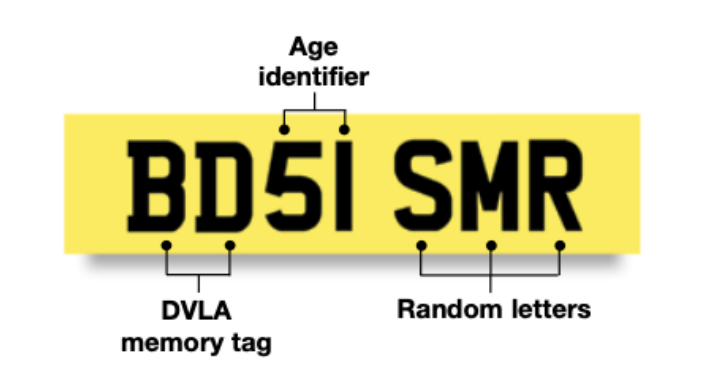

# Number Plate Generator

A Python program that generates unique UK-format number plates, given a DVLA memory tag and a registration date.

---

## How a Number Plate is Structured



A plate has the format `XX00 XXX`:

| Part | Description | Example |
|---|---|---|
| `XX` | DVLA memory tag (supplied by you) | `MV` |
| `00` | Age identifier (calculated from the date) | `10` |
| `XXX` | Three randomly generated letters | `FRH` |

---

## Rules

- Every plate generated is **unique** — the same plate will never be issued twice, even across separate runs of the program.
- The letters **I**, **Q**, and **Z** will never appear on a plate — they look too similar to the digits 1, 0, and 2.
- The age identifier is calculated from the registration date. The vehicle year runs **March to February**, split into two halves:
  - **March – August**: age = last two digits of the year (e.g. 2010 → `10`)
  - **September – February**: age = last two digits + 50 (e.g. September 2001 → `51`)

---

## Setup

You will need Python 3.11 or later. Run these commands once from the project folder:

```bash
python -m venv .venv
source .venv/bin/activate
pip install -e ".[dev]"
```

---

## Generating a Plate

```bash
python -m number_plate_generator <memory_tag> <date>
```

**Examples** (matching the spec):

```bash
python -m number_plate_generator MV 03/04/2010
# MV10 ...

python -m number_plate_generator YA 25/09/2001
# YA51 ...
```

Run the same command multiple times — each call produces a different plate. The program remembers every plate it has ever issued.

---

## Resetting Plate History

To clear all previously issued plates and start fresh:

```bash
python -m number_plate_generator --reset
```

---

## Running the Tests

```bash
pytest -v
```

The test suite covers:

| Group | What it checks |
|---|---|
| `TestPlateFormat` | Output always matches the `XX00 XXX` structure |
| `TestAgeIdentifier` | Age is calculated correctly for all months, including edge cases |
| `TestRandomLetters` | Restricted letters never appear in the suffix |
| `TestUniqueness` | No two plates are ever identical within a session |
| `TestPersistence` | No two plates are ever identical across separate runs |

---

## Design Decisions

See [justification.md](justification.md) for a plain-English explanation of every decision made — from the project structure to the choice of data structures.
